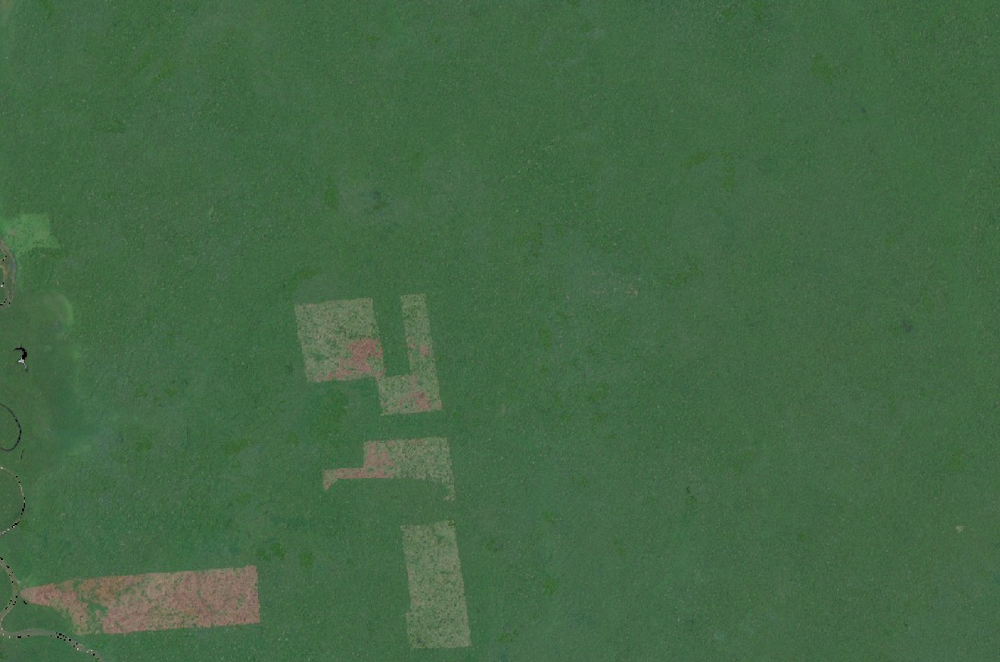
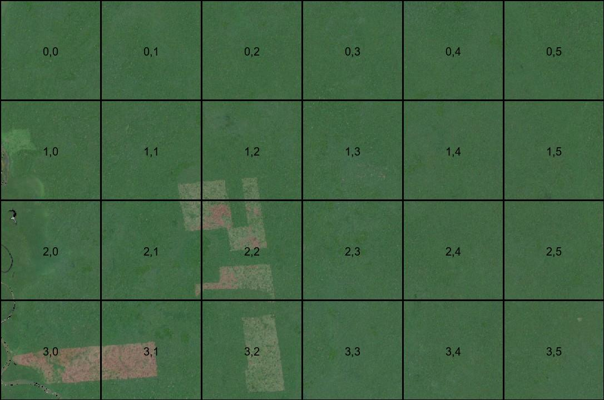
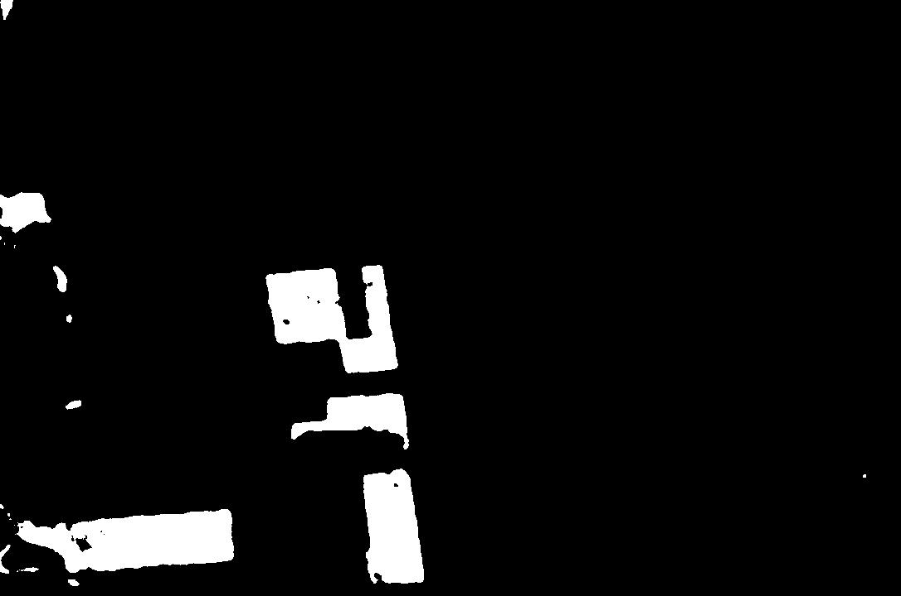

# TreeTracker

TreeTracker is a python based proof-of-concept for detecting and monitoring deforesting using a machine learning implementation.

## Installation

The software is ready to use-as is. All models are pre-trained by us and data for testing the functionality is provided. If issues are encountered, creating an environment according to the requirements might fix the issues. Tested as working on python 3.11.9
```python
pip install -r requirements.txt
````

## Demo

A demo of our dashboard can be found at [link](https://treetracker.coolify.codebite.fi/). The images used in creating the dashboard can be found in this repository in *satellite_images* and *satellite_images_area2*. The files in the *output* directory are created from the images in *satellite_images* 

## Usage

Put the input images in the *satellite_images* directory, some examples are already supplied. By running the main script

```python
python3 main.py
```
it will clean up any previous runs, and analyse all the pictures supplied in the *satellite_images* dirctory. Output will be created in the *ouput directory*. The following files will be created:
1. Copy of the original image
2. Copy of the original image, overlayed with a grid, showing the different areas of analysis
3. Transformed image with image segmentation applied to highlight problem areas
(This is then further split into smaller chunks for analysis, available after runs in *area_calculation/split_images*)
4. *detections.json* containing data about possible deforesting detections made by the models. There are two types:
    1. Label-Switch (LS), image classification model determined that the area has changed from forest to de-forested
    ```json
    {
        "date": "2022-04-01-00_00_2022-04-01-23_59",
        "type": "LS",
        "x_cord": "1",
        "y_cord": "0"
    }
    ```
    2. De-forested Area Increase (DAI), the area of deforested land within the chunck has increased at least 5%pt since the last data point
    ```json
    {
        "date": "2022-10-01-00_00_2022-10-01-23_59",
        "type": "DAI",
        "x_cord": "3",
        "y_cord": "1",
        "area_change": 23.21307011572498
    }
    ```
5. *statistics.json* gives information about the total area covered, as well as the bounding box surrounding the area and the the total forest coverage of the area over time. This can be used to create statistics of the are, given that the picture supplied as input cover the same area in chronological order.

## Authors
Team Cyber Surfers:\
David Enberg (david.enberg@aalto.fi)\
Markus Andersson (markus.o.andersson@aalto.fi)\
Johannes Peltola (johannes.e.peltola@aalto.fi)

## License

[MIT](https://choosealicense.com/licenses/mit/)